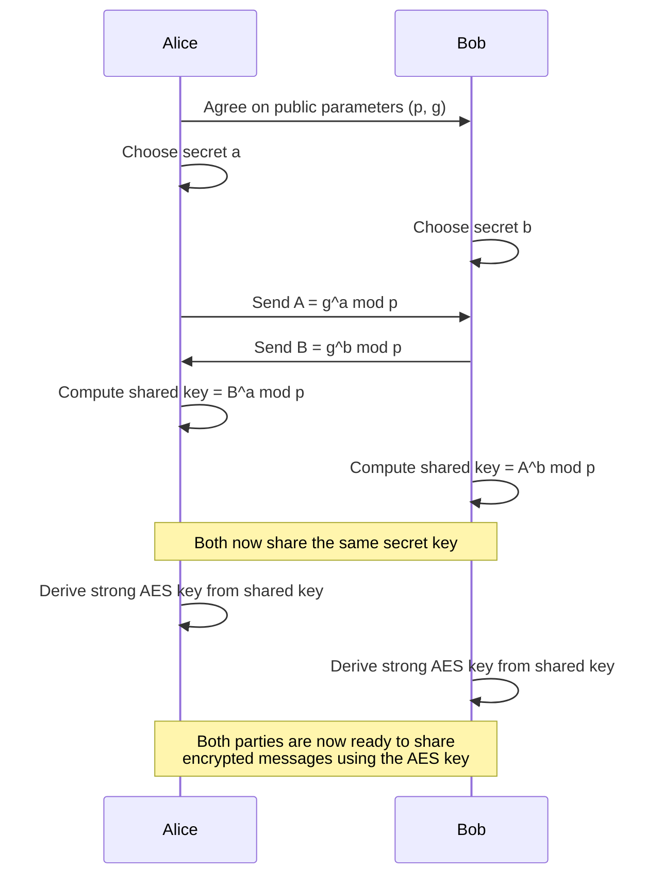

# Diffie-Hellman Key Exchange Sequence

---

## Explanation of Parameters and Secrets

**p (prime modulus):**

- A large prime number agreed upon by both parties.
- All calculations are performed modulo p.
- **Mathematical property:** p should be a safe prime (i.e., (p-1)/2 is also prime) to prevent certain attacks.
- **Common sizes:** At least 2048 bits for modern security.

**g (generator):**

- A number less than p, also agreed upon by both parties.
- **Mathematical property:** g should be a primitive root modulo p, meaning its powers generate all numbers from 1 to p-1.
- **Common values:** 2 or 5 are often used, but must be chosen carefully with p.

**a, b (private secrets):**

- Randomly chosen integers, kept secret by Alice (a) and Bob (b).
- **Mathematical property:** 1 < a, b < p-1.
- **Common sizes:** Should be at least as large as the bit length of p (e.g., 2048 bits).

**Security Note:**  
The security of Diffie-Hellman relies on the difficulty of the discrete logarithm problem: given g, p, and g^a mod p, it is computationally infeasible to determine a.
