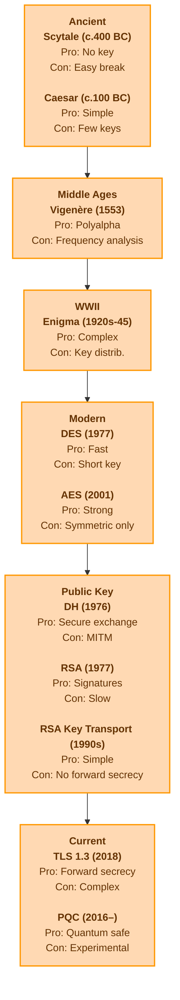

# History of Cryptography

---

## Explanation of Terms

**Frequency analysis:**
A cryptanalysis technique that studies the frequency of letters or groups of letters in a ciphertext. It exploits the fact that, in any given language, certain letters and combinations appear with predictable frequencies, making simple substitution ciphers vulnerable.

**No forward secrecy:**
A property of some encryption schemes where, if the long-term private key is compromised, all past communications encrypted with that key can also be decrypted. Forward secrecy prevents this by generating unique session keys for each communication session.

**MITM (Man-in-the-Middle):**
A type of attack where an attacker secretly intercepts and possibly alters the communication between two parties who believe they are directly communicating with each other.

**Key transport:**
A method in cryptography where one party generates a symmetric key and securely sends ("transports") it to the other party, typically using the recipient's public key for encryption. The receiving party then decrypts the key with their private key, and both parties use the shared symmetric key for further communication.

**Key agreement or key exchange**
Both parties contribute key material to jointly derive the shared secret (e.g., DH).

**Why wasn't Diffie-Hellman (DH) used in early TLS versions, despite being invented in 1976?**
Although DH was invented in 1976, it was not widely used in protocols like SSL/TLS until much later due to several reasons:

- **Patent restrictions:** DH was patented and required licensing fees, which discouraged early adoption in commercial software.
- **Performance and implementation complexity:** Early computers were less powerful, and DH computations were more resource-intensive and harder to implement securely compared to RSA key transport.
- **Market adoption:** RSA became the de facto standard for public key cryptography in the 1990s, and many systems were built around it.
- **Transition period:** Only after patents expired and the need for forward secrecy became more widely recognized did DH (and especially ephemeral DH) become the preferred method for secure key exchange in protocols like TLS 1.2 and TLS 1.3.
