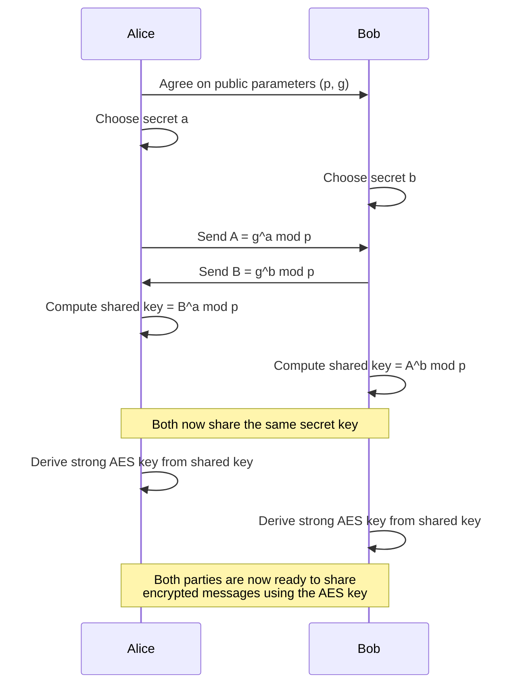

### Diffie-Hellman Key Exchange Sequence

```mermaid {scale: 0.45}
sequenceDiagram
    participant Alice
    participant Bob

    Alice->>Bob: Agree on public parameters (p, g)
    Alice->>Alice: Choose secret a
    Bob->>Bob: Choose secret b
    Alice->>Bob: Send A = g^a mod p
    Bob->>Alice: Send B = g^b mod p
    Alice->>Alice: Compute shared key = B^a mod p
    Bob->>Bob: Compute shared key = A^b mod p
    Note over Alice,Bob: Both now share the same secret key
    Alice->>Alice: Derive strong AES key from shared key
    Bob->>Bob: Derive strong AES key from shared key
    Note over Alice,Bob: Both parties are now ready to share<br>encrypted messages using the AES key
```

